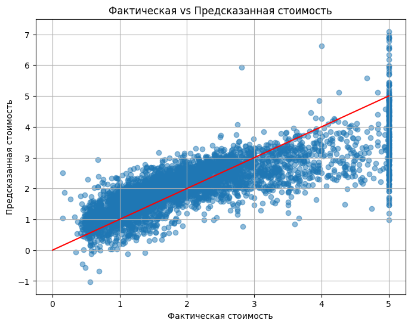

# 🏠 Предсказание стоимости домов в Калифорнии

Простой проект по линейной регрессии для прогнозирования цен на жильё по характеристикам района.
Используется датасет California Housing из sklearn.

## Метрики:

- RMSE: 0.72
- R²: 0.60

## Визуализация:

## Используемые библеотеки:

- pandas, numpy, matplotlib, seaborn
- sklearn